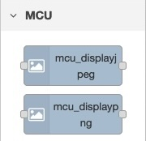
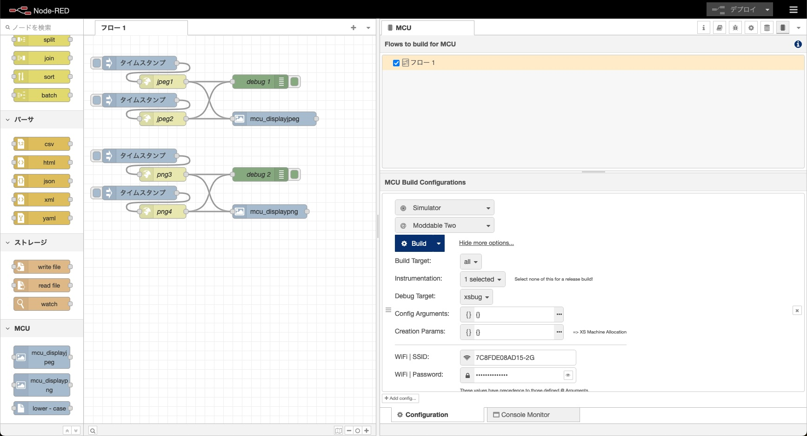
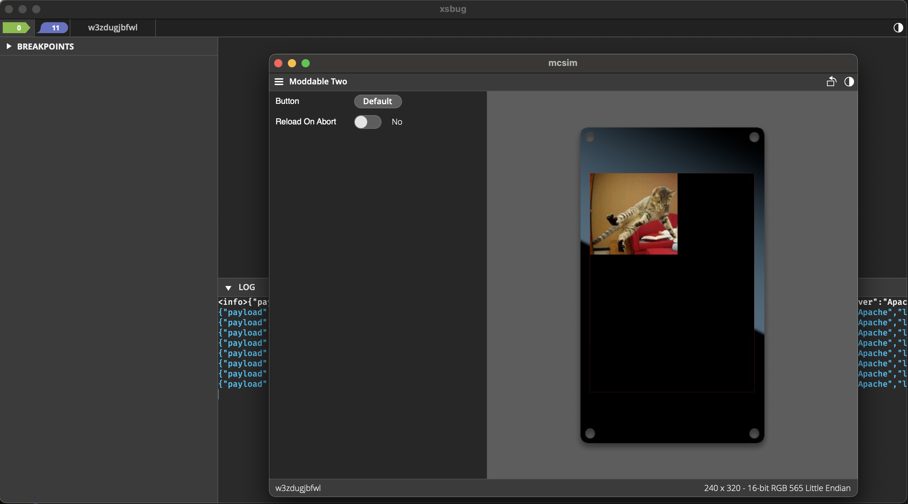

# node-red-contrib-mcu-display-image

Node to display JPEG/PNG with Node-RED MCU

## Overview



## How to use

0. Build the environment for the Node-RED MCU plugin  
1. Install this node  
Add from the "Manage palette" in Node-RED or execute the following command.  

```
npm install <folder_path>  
```
2. Try to build with the Node-RED MCU plugin.

## Node-RED flow



## Sample test



